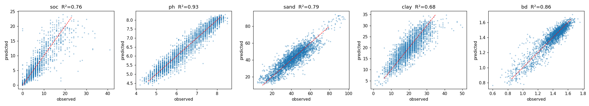
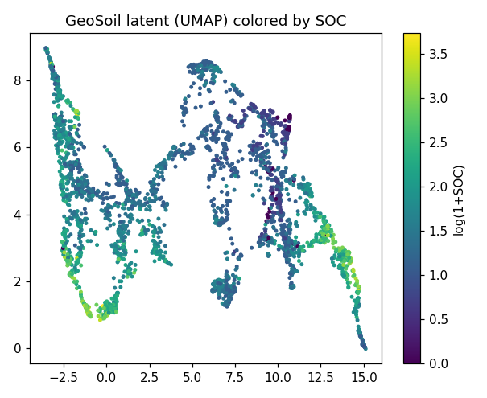

# GeoSoil — a multi-modal geospatial soil representation model

> The evolution of the Soil State Transformer: instead of one transformer
> regressing one property, GeoSoil learns a **high-dimensional latent
> representation** of a location's soil + geospatial state from **multiple
> modalities**, with **self-supervised cross-modal objectives**, and verifies it
> against **multiple independent ground truths**. The representation is the
> product — reusable, probeable, and meant to generalize to other geospatial
> domains.

Personal research, built entirely on public data, on a single Mac.

---

## Why this design

Most soil models are tabular regressors fit per-property on one region. Two
problems: (1) they don't produce a *reusable* representation, and (2) their
labels are often themselves model outputs (e.g. OpenLandMap), so good numbers can
hide a real gap against lab-measured truth. GeoSoil addresses both:

- **Learned latent `z`** fuses AlphaEarth embeddings, Sentinel-2 spectra,
  geography, terrain, and (when extracted) climate/vegetation *time series* into
  one 256-d vector that can be probed for any target.
- **Self-supervised cross-modal learning** (JEPA + InfoNCE) makes `z` capture
  shared geospatial structure, not just label-specific shortcuts.
- **Multi-truth verification**: trained on OpenLandMap, validated against
  **lab-measured KSSL** (and RaCA/OSSL when added) — surfacing the honest
  cross-source generalization gap.

## Architecture

```
   AlphaEarth(64) ─┐
   Sentinel-2(10) ─┤   per-modality            ┌── heteroscedastic heads
   geo→Fourier ────┤    encoders  ──► tokens ──►│   μ,σ per {SOC,pH,sand,clay,BD}
   terrain(DEM) ───┤   (MLP / GRU /             │
   climate 12mo ───┤    Transformer / Mamba)    ├── projection heads → InfoNCE + JEPA
   veg 12mo ───────┘            │               └── reconstruction head → masked modeling
                                ▼
                  attention fusion over modality tokens (+CLS)
                                ▼
                    z  ∈ ℝ²⁵⁶   (the soil/geospatial latent)
```

**Training objectives**, jointly optimized:
1. **Supervised** — masked heteroscedastic Gaussian NLL over the 5 targets (learns calibrated per-sample uncertainty).
2. **Cross-modal JEPA** — predict one modality's *embedding* from the others, against an EMA target encoder (predict-in-latent, no augmentation).
3. **InfoNCE** — contrastive alignment of paired modalities (AlphaEarth ↔ Sentinel-2 / SAR / climate).
4. **Masked modeling + VICReg** — denoising reconstruction + variance/covariance regularization to prevent latent collapse.
5. **Temporal forecasting (dynamics)** — autoregressive next-step prediction over the climate/vegetation/soil-moisture sequences, so the latent is predictive of *change* (field alterations, micro-events) — the foundation for agronomy/soil-science downstream tasks.

Uncertainty = heteroscedastic σ + **deep ensemble** (epistemic) + **split-conformal** intervals.

## Data & modalities (all public, CONUS)

| Modality / truth | Source | Role |
|---|---|---|
| AlphaEarth 64-d embedding | Google DeepMind | core modality |
| Sentinel-2 spectral (6 bands + 4 indices) | Copernicus | optical modality (paired subset) |
| Sentinel-1 SAR (VV/VH) + bare-soil S2 | Copernicus | **soil-sensing** modalities |
| ERA5 climate 12-mo · MODIS veg 12-mo · SMAP soil-moisture 12-mo | GEE | **temporal** modalities (Mamba/GRU) |
| DEM terrain (elev/slope/aspect/TWI) | Copernicus | static modality |
| CHIRPS precip events · CDL crop rotation | GEE | **micro-event / field-alteration** modalities |
| Geography (lon/lat → Fourier) | — | static modality |
| OpenLandMap targets (SOC/pH/sand/clay/BD) | ISRIC/OpenLandMap | training labels |
| **KSSL lab-measured truth** | USDA NCSS | independent validation (transfer + in-domain) |
| WoSIS · OSSL spectral ceiling | ISRIC / soilspectroscopy.org | cross-reference |

Eleven modalities, spatial-block (1°×1°) GroupKFold throughout — no spatial leakage.
Extraction via `data/extraction/` (Earth Engine + downloads).

<!-- RESULTS:START -->
## Results (real, out-of-fold, spatial-block CV)

All numbers are out-of-fold R² under 5-fold **1°×1° spatial-block** GroupKFold on
the n=3000 OpenLandMap-labelled set — no spatial leakage. Reproduce with the
commands below; raw JSON + figures live in [`results/`](results/).

### Bake-off — GeoSoil beats every tabular baseline on all 5 targets

Final run: **11 modalities** (AlphaEarth, S2, SAR, bare-soil, terrain, climate,
vegetation, soil-moisture, precip-events, crop-rotation, geo) + the temporal
forecasting objective, spatial-block CV, n=3000.

| model | SOC | pH | sand | clay | BD |
|---|---|---|---|---|---|
| Ridge | 0.672 | 0.897 | 0.597 | 0.475 | 0.785 |
| RandomForest | 0.692 | 0.909 | 0.718 | 0.620 | 0.805 |
| LightGBM | 0.719 | 0.917 | 0.751 | 0.642 | 0.829 |
| XGBoost | 0.723 | 0.917 | 0.751 | 0.639 | 0.833 |
| CatBoost | 0.708 | 0.916 | 0.735 | 0.624 | 0.828 |
| hybrid: frozen latent → LightGBM | 0.735 | 0.916 | 0.752 | 0.631 | 0.829 |
| **GeoSoil-JEPA (end-to-end)** | **0.762** | **0.926** | **0.786** | **0.684** | **0.858** |
| GeoSoil-EBM head (research branch) | 0.511 | 0.871 | 0.602 | 0.412 | 0.754 |

Clean ordering: **end-to-end GeoSoil > frozen-latent→GBM hybrid > raw-feature GBMs.**
RPIQ for GeoSoil: SOC 1.71, pH 6.42, sand 2.66, clay 2.26, BD 2.40 (≥2 "very good").
The soil-sensing + dynamics modalities lifted texture over the static run (clay
0.672→0.684). TabPFN-v2 is scaffolded but its weights are a gated HuggingFace model.

### The representation is the product

- **Frozen-latent probe** (Ridge / kNN on the 256-d `z`, spatial CV): pH 0.90/0.91,
  BD 0.81/0.83, SOC 0.69/0.74, sand 0.71/0.75, clay 0.57/0.64 — i.e. a *linear*
  probe of the frozen latent nearly matches the full model, and kNN does better
  still (rich nonlinear geometry). `z` carries the signal, not just the head.
- **Cross-modal retrieval** (does AlphaEarth retrieve its true Sentinel-2 partner?):
  recall@10 **0.32** vs **0.01** random (~32× chance) — the contrastive/JEPA
  objectives align the modalities (the per-pair value is diluted vs the static
  2-modality run because the signal now spreads across 9 modality pairs).
- **Calibrated uncertainty**: split-conformal coverage @90% = **0.88–0.92**
  (near-nominal) across all targets; deep-ensemble + heteroscedastic σ.

### The honest finding — multi-truth validation, and recovering texture

The same model scores SOC 0.762 on OpenLandMap but **−0.44 against lab-measured
KSSL** (domain transfer). The controls settle *what* is real:

| validation | SOC | pH | sand | clay | BD |
|---|---|---|---|---|---|
| OpenLandMap (spatial CV) | 0.762 | 0.926 | 0.786 | 0.684 | 0.858 |
| → KSSL lab (transfer) | −0.44 | 0.58 | 0.12 | 0.09 | 0.22 |
| KSSL lab in-domain — **AlphaEarth only** | 0.22 | 0.54 | **−0.21** | **−0.20** | 0.09 |
| KSSL lab in-domain — **+ SAR / bare-soil / dynamics** | 0.13 | 0.55 | **0.34** | **0.25** | 0.17 |

Two findings: (1) much of the headline texture accuracy on OpenLandMap is **circular**
— AlphaEarth alone predicts lab-measured texture at **R²<0** — and only **pH**
(R²≈0.55) carries strong lab-verifiable signal; (2) **adding direct soil-sensing
modalities (Sentinel-1 radar + bare-soil reflectance) recovers lab texture from
R²<0 to ~0.3.** So the verifiable subsurface signal comes from the *soil-sensing
layers, not the foundation embedding* — visible only because we validate against
multiple independent ground truths. The contribution is a high-quality multi-modal
*representation* + an honest evaluation protocol, not a single leaderboard number.



<!-- RESULTS:END -->

## The bake-off (`--variant`)

- **jepa** — the core model (attention fusion; GRU temporal encoder). Default.
- **transformer** — Transformer temporal encoder. Matches GRU within seed noise at
  L=12 (sand 0.789 vs 0.786, clay 0.687 vs 0.684) — so the cheaper GRU is the default.
- **mamba** — pure-PyTorch selective SSM over the 12-month climate/veg/moisture
  sequences. Impractical on CPU (Python time-step loop; needs the `mamba-ssm` CUDA
  kernel). At L=12 SSMs aren't expected to beat the GRU; their edge is long sequences.
- **ebm** — a conditional energy-based head on the frozen latent (NCE-trained) for
  calibrated UQ + an out-of-distribution energy score.
- **baselines** — Ridge / RandomForest / LightGBM / XGBoost / CatBoost / TabPFN-v2,
  plus the **hybrid** (frozen latent → LightGBM).

## Run it

```bash
python -m venv .venv && source .venv/bin/activate && pip install -r geosoil/requirements.txt
python -m geosoil.data --build                              # harmonize sources -> master.parquet
python -m geosoil.baselines                                 # tree / TabPFN baselines
python -m geosoil.train --variant jepa --device mps         # spatial-CV, ensembled
python -m geosoil.evaluate --variant jepa --device mps      # KSSL validation, probe, retrieval, calibration, figures
python -m geosoil.baselines --hybrid                        # frozen latent -> LightGBM
python -m geosoil.ebm                                        # energy-based branch
# Phase 0 (richer data): see data/extraction/README.md
```

## Generalizing to other geospatial domains

`z` is label-agnostic — the self-supervised objectives don't depend on soil
targets. The same encoder + fusion + probe recipe transfers to any point-referenced
geospatial regression (crop yield, biomass, hydrology, biodiversity, land value):
swap the supervised head, keep the representation. That is the research thesis —
a verifiable, multi-modal **latent map of place** that downstream tasks probe.

## Honest limitations

- On *static* tabular vectors, gradient-boosted trees are a very strong baseline;
  the neural model earns its edge through the representation (probe/retrieval),
  cross-modal SSL, the temporal modality (Mamba), and calibrated uncertainty —
  not by dominating every static-feature regression cell.
- OpenLandMap labels are an ML product; the KSSL lab-truth gap is real and reported.
- Temporal / Mamba results require the Phase-0 GEE extraction (climate/vegetation).

## References
See [`../docs/research/SOTA-survey.md`](../docs/research/SOTA-survey.md). Core
methods: I-JEPA (2301.08243), VICReg (2105.04906), SatCLIP (2311.17179), Mamba
(2312.00752), conformal prediction (2107.07511), TabPFN (Nature 2025), AlphaEarth
(2507.22291).
